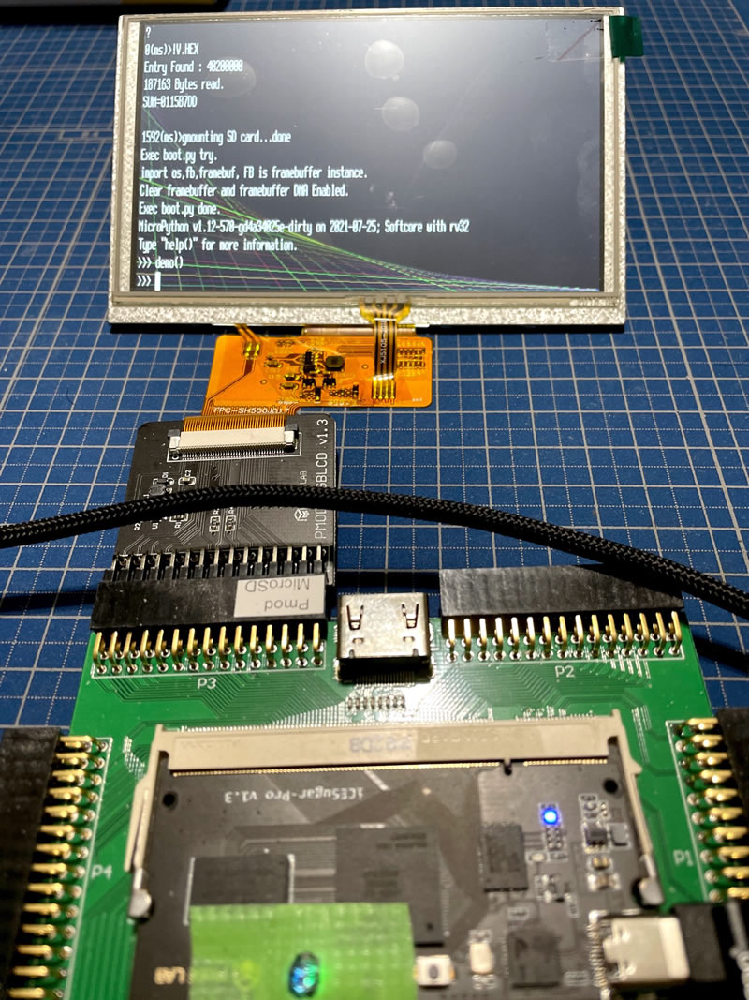

# Briey SoC on [ICESugar Pro](https://github.com/wuxx/icesugar-pro) (Lattice ECP5)


## About Briey Soc
+ The [Briey SoC](https://github.com/SpinalHDL/VexRiscv#briey-soc) is a sample SoC included in the [VexRiscv](https://github.com/SpinalHDL/VexRiscv).

## Similar Projects
- [Briey SoC on Sipeed Tang Primer](https://github.com/jmio/testvex)

## Supported HW
+ UART (Briey SoC, 115200bps)
+ SDRAM (Briey SoC)
+ [PMOD-RGBLCD by Muse Lab](https://github.com/wuxx/icesugar/blob/master/schematic/pmod_rgblcd-v1.3.pdf)  (SDRAM FrameBuffer:480x800 16bpp for Sipeed Tang Nano LCD)  @ PMOD P3 Connector 
+ TFCARD (Intel Hex Loader Support on Sample FW)
+ JTAG DEBUG @ iCELink 2nd JTAG (VexRiscv)

## HW Build Tool
+ [yosys](https://github.com/YosysHQ/yosys)
+ [nextpnr](https://github.com/YosysHQ/nextpnr)
+ [Project Trellis](https://github.com/YosysHQ/prjtrellis)

```
# Required packages
sudo apt-get install build-essential clang bison flex \
libreadline-dev gawk tcl-dev libffi-dev git \
graphviz xdot pkg-config python3 libboost-system-dev \
libboost-python-dev libboost-filesystem-dev zlib1g-dev cmake
```
```
# prjtrellis
git clone --recursive https://github.com/YosysHQ/prjtrellis
sudo apt-get install libboost-all-dev
cd prjtrellis/libtrellis
cmake -DCMAKE_INSTALL_PREFIX=/usr .
make
sudo make install

# yosys
git clone --recursive  https://github.com/YosysHQ/yosys.git
cd yosys
make config-clang
make -j7
sudo make install

# nextpnr-ecp5
sudo apt install libeigen3-dev
git clone --recursive  https://github.com/YosysHQ/nextpnr.git
cd nextpnr
cmake . -DARCH=ecp5 -DTRELLIS_INSTALL_PREFIX=/usr
make -j7
sudo make install
```

After completing the above settings, go to the project folder and execute the following to build.

```
$ cd (Project Folder)
$ ./build_top.sh
```

For those of you using ICESugarPro, I would like to add that drag-and-drop writing using the JTAG chip (iCELink) may fail.

If it does not work properly, please try re-writing using icesprog or ecpdap.

## FW Build Tool , JTAG Debug
+ VS Code (IDE : Tested on Windows)

+ GNU MCU Eclipse RISC-V Embedded GCC 8.2.0 (Tested on Windows)

+ make.exe

+ [icesprog](https://github.com/wuxx/icesugar/tree/master/tools)

+ [ecpdap](https://github.com/adamgreig/ecpdap) (if needed)

+ openocd for vexriscv (Windows Binary included)
https://github.com/SpinalHDL/openocd_riscv  

   (You must run "icesprog -j 2" before SoC Debugging)

+ The folder names are embedded in "tasks.json" and "launch.json", so you need to rewrite them.
Make sure that riscv-none-embed-gcc, make and openocd work properly.

Example of embedding
```
            "debugServerArgs": "-c \"set VEXRISCV_YAML C:/(PROJECT FOLDER)/testvex/briey/Briey.yaml\" -f ${workspaceFolder}/vexriscv_dual.cfg",

                {"text": "-file-exec-and-symbols C:/(PROJECT FOLDER)/testvex/briey/progmem.elf","description": "set architecture","ignoreFailures": false},
 
```

## Create Custom Briey.v for this project
1. Clone VexRiscv Repo.
```
cd 
git clone https://github.com/SpinalHDL/VexRiscv.git
git checkout 2de35e6116e623e2d5465f753a1c84104fa127cb
(ignore warning)
```
2. Copy Briey.scala included in the project to the demo folder of VexRiscv and reconfigure it with sbt.

```
cp ~/(This Project)/Briey.scala ~/VexRiscv/src/main/scala/vexriscv/demo/
cd ~/VexRiscv/
sbt "runMain vexriscv.demo.BrieyICESugarPro"
```

3. Replace the $readmem section of the generated Briey.v with the following (included in the project as progmemh.v.txt)

```
    initial begin
        $readmemh("briey/progmem0.hex",ram_symbol0);
        $readmemh("briey/progmem1.hex",ram_symbol1);
        $readmemh("briey/progmem2.hex",ram_symbol2);
        $readmemh("briey/progmem3.hex",ram_symbol3);
    end
```

4. Copy the generated cpu0.yaml as Briey.yaml to the "Briey" folder under the project (or as specified in launch.json). 

## Sample FW

+ Monitor Command
```
?:HELP
D:Dump     - D(Begin),(End)
F:Fill     - F(Begin),(End),(Val)
G:Go       - G<STARTENTRY:fromihex>
R:Read Intel Hex
S:Set      - S(Addr)
=:SD DIR   - =
!:SD IHEX  - !(Filename)
T:TP TEST   (NOP , It's the same FW as the Sipeed Tang project.)
```

+ Run MicroPython Port Demo

   + [micropython port for this monitor](https://github.com/jmio/micropython)

```
cd port/rv32
make V=1
```

then v.hex and v.elf created at ports/rv32/build/.



1. Copy [v.hex](https://github.com/jmio/testvex/blob/main/mpybin/v.hex) and [boot.py](https://github.com/jmio/testvex/blob/main/mpybin/boot.py) to TFCARD
2. Type "!V.HEX" on monitor prompt to load HEX into SDRAM
3. Type "G" on monitor prompt to Run MicroPython Binary on SDRAM
4. Run "demo()" on MicroPython Prompt to Run FrameBuffer Demo on [boot.py](https://github.com/jmio/testvex/blob/main/mpybin/boot.py)

## Reference

+ [Colorlight i5 Tips](https://github.com/kazkojima/colorlight-i5-tips)
+ [LiteX](https://github.com/enjoy-digital/litex)

   + Yosys build script
   + Pin mapping for ICESugarPro
   + How to use ECP5's PLL and create RAM, and Text Font
 
 